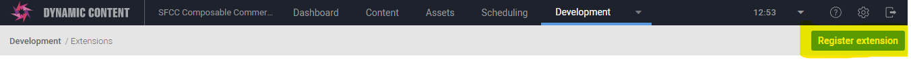
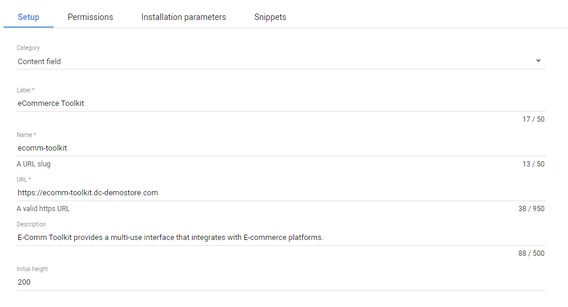
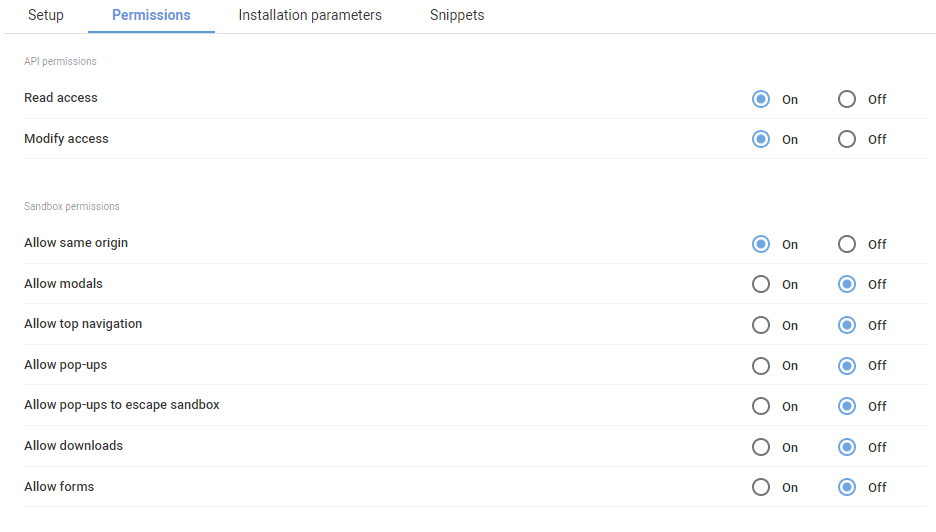

# Extension Setup

First you'll need to register the extension against an Amplience Dynamic Content Hub. General guidance can be found [here](https://amplience.com/developers/docs/integrations/extensions/register-use/) and following the specifics below:

Login to your Hub and head to Development > Extensions and click the "Register" button.

## Base Extension Setup

Under the setup tab put the URL where your extension is hosted:

- Category: Content Field
- Label: ecomm Toolkit (this will appear as the tab title in the Dashboard)
- Name: ecomm-toolkit (needs to be unique with the Hub)
- URL: https://ecomm-toolkit.extensions.content.amplience.net (see below for URL based on setup)
- Description: eCommerce Toolkit provided a multi-user user interface that integrations with eCommerce platforms (can be left blank, if you wish)

### URL options for Extension Setup

-   Amplience hosted (if you are not self hosting which points to our 'production' branch): `https://ecomm-toolkit.extensions.content.amplience.net`
-   Self hosted: This will be your main brand deployment URL
-   Development: This will either be `http://localhost:3000` of your dev branch deployement url

## Extension Permissions Settings

Under the Permissions tab, select the following:

-   API Permissions:
    -   ✅ Read Access
    -   ✅ Modify Access
-   Sandbox Permissions:
    -   ✅ Allow Same Origin 

## Extensions Installation Parameters & Setup

In order to have this extension point to your SFCC instance you need specific installation params, instance details and API access. 

[Extension Instalation Params Docs](https://amplience.com/developers/docs/integrations/extensions/register-use/#installation-parameters)

Full details can be seen in the `dc-integration-middleware` project [here](https://github.com/amplience/dc-integration-middleware/blob/main/docs/vendor/commerce/sfcc.md)
